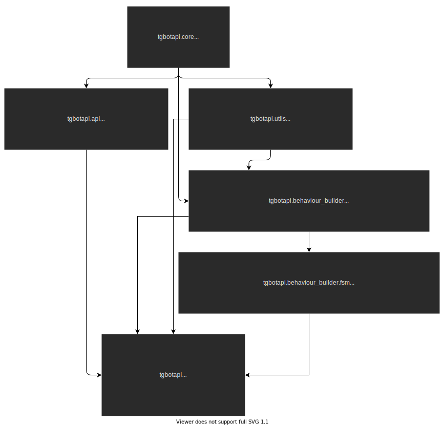

# TelegramBotAPI

| Common info                           | [](https://github.com/KotlinBy/awesome-kotlin) [](https://travis-ci.com/InsanusMokrassar/TelegramBotAPI) [Small survey](https://forms.gle/tnjuExdSKEr32ygKA)|
| -------------------------------------:|:------------------------------------------------------------------------------------------------------------------------------------------------------------------------------------------------------------------------------------------------------------------------------------------------------------------------------------------------------------------------------------------------------------------------------------------------------------------------------------------------ |
| Useful links | [](https://t.me/InMoTelegramBotAPI) [](https://tgbotapi.inmo.dev/docs/index.html) [Examples](https://github.com/InsanusMokrassar/TelegramBotAPI-examples/), [Mini tutorial](https://bookstack.inmo.dev/books/telegrambotapi/chapter/introduction-tutorial) |
| TelegramBotAPI Core status                 | [](https://bintray.com/insanusmokrassar/StandardRepository/TelegramBotAPI-core/_latestVersion) [](https://maven-badges.herokuapp.com/maven-central/com.github.insanusmokrassar/TelegramBotAPI) |
| TelegramBotAPI Extensions status      | [](https://bintray.com/insanusmokrassar/StandardRepository/TelegramBotAPI-extensions-api/_latestVersion) [](https://maven-badges.herokuapp.com/maven-central/com.github.insanusmokrassar/TelegramBotAPI-extensions-api) |
| TelegramBotAPI Util Extensions status | [](https://bintray.com/insanusmokrassar/StandardRepository/TelegramBotAPI-extensions-utils/_latestVersion) [](https://maven-badges.herokuapp.com/maven-central/com.github.insanusmokrassar/TelegramBotAPI-extensions-utils) |
| TelegramBotAPI All status                 | [](https://bintray.com/insanusmokrassar/StandardRepository/TelegramBotAPI/_latestVersion) [](https://maven-badges.herokuapp.com/maven-central/com.github.insanusmokrassar/TelegramBotAPI-all)                                                             |

It is a complex of libraries for working with `TelegramBotAPI` in type-safe and strict way as much as it possible. In
the list of this complex currently next projects:

* [TelegramBotAPI-core](TelegramBotAPI-core/README.md) - core of library. In fact it is independent library and can be used alone
  without any additional library
* [TelegramBotAPI Extensions](TelegramBotAPI-extensions-api/README.md) - contains extensions (mostly for
  `RequestsExecutor`), which allows to use the core library in more pleasant way
* [TelegramBotAPI Util Extensions](TelegramBotAPI-extensions-utils/README.md) - contains extensions for more comfortable
work with commands, updates and other different things
* [TelegramBotAPI](TelegramBotAPI/README.md) - concentration of all previously mentioned libraries

Most part of some specific solves or unuseful
moments are describing by official [Telegram Bot API](https://core.telegram.org/bots/api).

## JavaScript notes

In case if you are want to use this library inside of browser, you will need additional settings (thanks for help to [Alexander Nozik](https://research.jetbrains.org/researchers/altavir)):

<details>
<summary>Gradle build script help (for versions before 0.28.0)</summary>

```groovy
dependencies {
    /* ... */

    implementation "com.github.insanusmokrassar:TelegramBotAPI:$tgbot_api_version"
    implementation "com.github.insanusmokrassar:TelegramBotAPI-extensions-api:$tgbot_api_version" // optional
    implementation "com.github.insanusmokrassar:TelegramBotAPI-extensions-utils:$tgbot_api_version" // optional

    /* Block of dependencies for correct building in browser */
    implementation(npm("fs"))
    implementation(npm("bufferutil"))
    implementation(npm("utf-8-validate"))
    implementation(npm("abort-controller"))
    implementation(npm("text-encoding"))
}

/* ... */

kotlin {
    target {
        browser {
            /* Block for fix of exception in absence of some functionality, https://github.com/ktorio/ktor/issues/1339 */
            dceTask {
                dceOptions {
                    keep("ktor-ktor-io.\$\$importsForInline\$\$.ktor-ktor-io.io.ktor.utils.io")
                }
            }
        }
    }
}
```

</details>

## Ok, where should I start?



In most cases, the most simple way will be to implement [TelegramBotAPI](TelegramBotAPI/README.md) - it contains
all necessary tools for comfort usage of this library. If you want to exclude some libraries, you can implement just
[TelegramBotAPI API Extensions](TelegramBotAPI-extensions-api/README.md),
[TelegramBotAPI Util Extensions](TelegramBotAPI-extensions-utils/README.md) or even
[TelegramBotAPI-core](TelegramBotAPI-core/README.md).

If you want to dive deeper in the core of library or develop something for it - welcome to learn more from
[TelegramBotAPI-core](TelegramBotAPI-core/README.md) and our [Telegram Chat](https://teleg.one/InMoTelegramBotAPIChat).

Anyway, all libraries are very typical inside of them. Examples:

* In `TelegramBotAPI` common request look like `requestsExecutor.execute(SomeRequest())`
* `TelegramBotAPI-extensions-api` typical syntax look like `requestsExecutor.someRequest()` (in most cases it would be
better to use `bot` name instead of `requestsExecutor`)
* `TelegramBotAPI-extensions-utils` will look like `filter.filterBaseMessageUpdates(chatId).filterExactCommands(Regex("^.*$"))...`

## Build instruction

If you want to build this project or to contribute, there are several recommendations:

### Build

In case if you want to just build project, run next command:

```bash
./gradlew clean build
```

On windows:

```
gradlew.bat clean build
```

### Publishing for work with your version locally

In case, if you want to work in your other projects using your modification (or some state) of this library,
you can use next code:

```bash
./gradlew clean build publishToMavenLocal
```

On windows:

```
gradlew.bat clean build publishToMavenLocal
```

But you must remember, that in this case your local maven repo must be the first one from
your project retrieving libraries:

```groovy
repositories {
    mavenLocal() // that must be the first one
    jcenter()
    mavenCentral()
}
```

Besides, for your own version you can change variable `library_version` in the file [gradle.properties](./gradle.properties).
